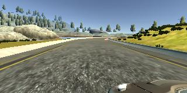
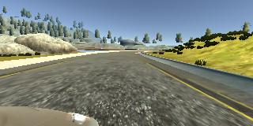

# **Behavioral Cloning** 

---

**Behavioral Cloning Project**

The goals / steps of this project are the following:
* Use the simulator to collect data of good driving behavior
* Build, a convolution neural network in Keras that predicts steering angles from images
* Train and validate the model with a training and validation set
* Test that the model successfully drives around track one without leaving the road
* Summarize the results with a written report


## Rubric Points
### Here I will consider the [rubric points](https://review.udacity.com/#!/rubrics/432/view) individually and describe how I addressed each point in my implementation.  

---
### Files Submitted & Code Quality

#### 1. Submission includes all required files and can be used to run the simulator in autonomous mode

My project includes the following files:
* model.py containing the script to create and train the model
* drive.py for driving the car in autonomous mode
* model.h5 containing a trained convolution neural network 
* writeup_report.md or writeup_report.pdf summarizing the results

#### 2. Submission includes functional code
Using the Udacity provided simulator and my drive.py file, the car can be driven autonomously around the track by executing 
```sh
python drive.py model.h5
```

#### 3. Submission code is usable and readable

The model.py file contains the code for training and saving the convolution neural network. The file shows the pipeline I used for training and validating the model, and it contains comments to explain how the code works.

### Model Architecture and Training Strategy

#### 1. An appropriate model architecture has been employed

My model consists of a convolution neural network with 5x5 and 3x3 filter sizes and depths between 24 and 64 (model.py lines 64-80) 

The model includes RELU layers to introduce nonlinearity (code lines 68-77), and the data is normalized in the model using a Keras lambda layer (code line 64). 

#### 2. Attempts to reduce overfitting in the model

The model contains dropout layers in order to reduce overfitting (model.py line 73). 

The model was trained and validated on different data sets to ensure that the model was not overfitting. The model was tested by running it through the simulator and ensuring that the vehicle could stay on the track.

#### 3. Model parameter tuning

The model used an adam optimizer, so the learning rate was not tuned manually (model.py line 79).

#### 4. Appropriate training data

Training data was chosen to keep the vehicle driving on the road. I used a combination of center lane driving, recovering from the left and right sides of the road. 

For details about how I created the training data, see the next section. 

### Model Architecture and Training Strategy

#### 1. Solution Design Approach

The overall strategy for deriving a model architecture was to use the convolution enural network model similar to the one from the Nvidia autonomous vehicle team. 

In order to gauge how well the model was working, I split my image and steering angle data into a training and validation set. I found that my first model had a low mean squared error on the training set but a high mean squared error on the validation set. This implied that the model was overfitting. 

To combat the overfitting, I modified the model by including a dropout layer in the model. 

Then I Captured data again on the first track. I still found the vehicle to be going off the road in the autonomous mode. I thought the data I recorded by manually driving the car in simulation mode was causing errors. So I chose to use the data provided by udacity for training the model.   

The final step was to run the simulator to see how well the car was driving around track one. 

At the end of the process, the vehicle is able to drive autonomously around the track without leaving the road.

#### 2. Final Model Architecture

The final model architecture (model.py lines 64-84) consisted of a convolution neural network with the following layers and layer sizes.

Layer	Description
Input	160x320x3 RGB image
Cropping	160x225x3 RGB image
Convolution 5x5	2x2 stride, valid padding, outputs 78x111x3
RELU	
Convolution 5x5	2x2 stride, valid padding, outputs 37x54x3
RELU	
Convolution 5x5	2x2 stride, valid padding, outputs 17x25x3
RELU	
Convolution 3x3	1x1 stride, valid padding, outputs 15x23x3
RELU	
Convolution 3x3	1x1 stride, valid padding, outputs 13x21x3
RELU	
Dropout	Keep probability of 50%
Flatten	outputs 819
Fully connected	outputs 100
RELU	
Fully connected	outputs 50
RELU	
Fully connected	outputs 10
RELU	
Fully connected	outputs 1

Below Image shows the model architecture 


 
#### 3. Creation of the Training Set & Training Process

To capture good driving behavior, I first recorded two laps on track one using center lane driving. Here is an example image of center lane driving:


I then recorded the vehicle recovering from the left side and right sides of the road back to center so that the vehicle would learn to correct its path towards the center.  These images show what a recovery looks like starting from left and right side respectively. 






To augment the data sat, I also flipped images and angles thinking that this would help in generalize. 

After the collection process, I had 44974 number of data points. I then preprocessed this data by centering around zero with small standard deviation. 

This data is split into 80% for training and 20 % for validation. 

I used this training data for training the model. The validation set helped determine if the model was over or under fitting. The ideal number of epochs was 5 as I first tried with 8 epochs and found the validation error increased after 5 epochs. I used an adam optimizer so that manually training the learning rate wasn't necessary.
